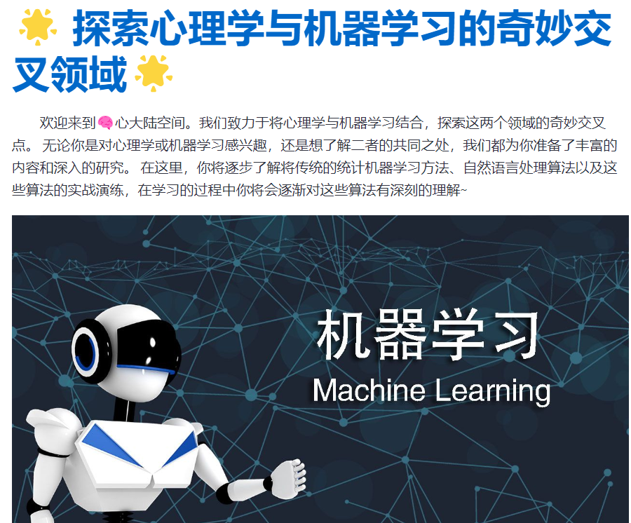

# 心理学与机器学习领域知识分享

​		[点击访问](https://mlapp-yanzibuguichunshiwan.streamlit.app/Guassian_Distribution)



# 大纲

- Foundation
- Guassian Distribution（基本完成）
- Linear Models For Regression
- Linear Models For Classification
- Kernel Methods
- Graphic Model
- Approximation Inference（正在更新）
- Sampling Methods
- Natural Language Processing
- Reinforcement learning（正在更新）
- Daily Notes

# 运行

```shell
streamlit run streamlit_demo.py
```

# 长期规划

- [ ] 补充Foundation等其他章节，每一章节提供一到两个趣味可视化环节便于理解算法。
- [ ] 心理学领域知识补充，结合心理学数据集进行数据分析与算法实战。
- [ ] 用户登录模块，提供心理测评服务，为不同用户生成“学习彩蛋”，积累到一定个数触发奖励🎁🎁🎁

# 本文算法章节主要参考书籍和教程

| 🚀 [pattern recognition and machine learning](https://www.microsoft.com/en-us/research/uploads/prod/2006/01/Bishop-Pattern-Recognition-and-Machine-Learning-2006.pdf) |
| :----------------------------------------------------------: |
|   🔮[统计学习方法](https://github.com/fengdu78/lihang-code)   |
| ⚡️[机器学习白板推导系列](https://space.bilibili.com/97068901) |
| 📘[speech and language processing](https://web.stanford.edu/~jurafsky/slp3/) |
| 📖[Reinforcement Learning (second edition)](http://incompleteideas.net/book/RLbook2020.pdf) |

